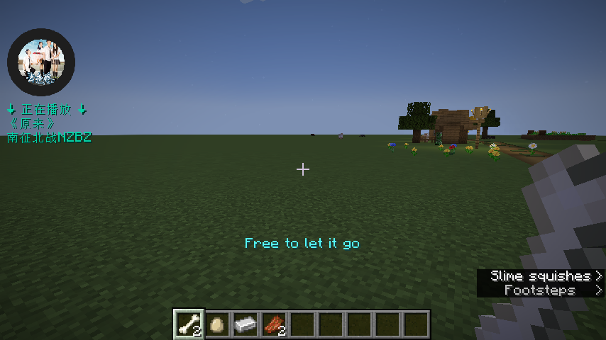

# RMusic

> 在我的世界中播放来自网易云音乐的歌曲

# 使用

> 服务器不需要安装任何模组

/rm login # 登录

/rm search # 搜索

/rm stop # 停止播放音乐

/rm pause # 暂停播放音乐

/rm resume # 继续播放音乐

/rm config # 配置

> 在设置中调整`唱片机/音符盒`的音量可以调整音乐的声音大小

> 按下esc会自动暂停音乐播放, 使用`/rm config auto-pause false` 来取消设置自动暂停, 设置成功后
> 使用`/rm reload`来重新加载配置文件

